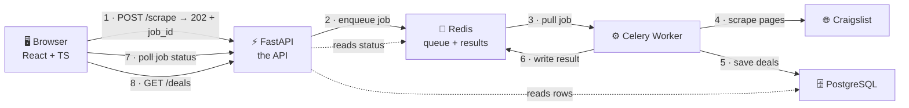
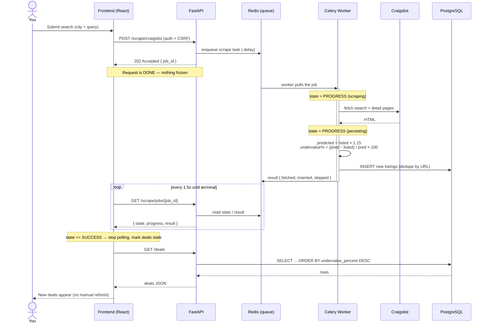

# How This System Works — A Learning Guide

> A from-scratch tour of **Car Deal Finder AI**: what each piece of technology is,
> *why* it's here, and how a single click travels through the whole stack.
>
> Read this top-to-bottom once to build the mental model, then use it as a
> reference. Every section answers three questions: **What is it? Why do we use
> it? How does it fit our app?**

---

## 0. The 30-Second Mental Model

We built an app that **finds underpriced used cars**. The flow in one breath:

1. You log in (the browser holds a secure session cookie).
2. You ask for cars in a city → the **API** says "got it, working on it" and hands the job to a **background worker**.
3. The worker **scrapes Craigslist**, estimates each car's fair price, calculates the discount, and saves the good ones to a **database**.
4. The browser **polls** for progress, and when the job finishes it **refreshes the list** of deals automatically.

Everything else in this document is detail about *how* each of those steps is done well — securely, responsively, and without the UI ever freezing.

```
┌─────────────┐   1. "find me cars"    ┌──────────────┐
│   Browser   │ ─────────────────────► │   FastAPI    │
│  (React)    │ ◄───────────────────── │   (the API)  │
└─────────────┘   2. "queued, job #42" └──────┬───────┘
      │                                        │ 3. push job
      │ 5. poll "job #42 done?"                ▼
      │                                  ┌──────────────┐
      │                                  │ Redis (queue)│
      │                                  └──────┬───────┘
      │                                         │ 4. pull job
      │                                         ▼
      │                                  ┌──────────────┐    scrape    ┌────────────┐
      │                                  │ Celery Worker│ ───────────► │ Craigslist │
      │                                  └──────┬───────┘              └────────────┘
      │                                         │ save deals
      ▼                                         ▼
┌─────────────┐    6. fetch deals       ┌──────────────┐
│   Browser   │ ◄────────────────────── │  PostgreSQL  │
└─────────────┘                         └──────────────┘
```

> The same picture, rendered (GitHub / VS Code show this as a real diagram):



The key idea worth internalizing: **the API never makes you wait for the scrape.**
It delegates the slow work and stays free to answer other requests. That single
architectural choice is what makes this feel like a real production system instead
of a script.

---

## 1. The Two Halves: Frontend and Backend

Every web app is split into two worlds that talk over HTTP.

| | **Frontend** | **Backend** |
|---|---|---|
| Runs on | Your browser | A server |
| Written in | TypeScript + React | Python + FastAPI |
| Job | Draw the UI, react to clicks | Store data, enforce rules, do the heavy lifting |
| Can be trusted? | **No** — anyone can edit it | **Yes** — you control the server |

That last row is the most important security idea in the whole app. **Never trust
the frontend.** The browser is the user's territory; they can change any value,
fake any request. So the backend re-checks everything: is this user logged in? are
they allowed? is the password right? The frontend is for *experience*; the backend
is for *truth*.

---

## 2. The Backend, Layer by Layer

### 2.1 FastAPI — the front door (the "API")

**What it is:** A Python web framework. An *API* (Application Programming Interface)
is just a set of URLs the frontend can call, each doing one job — `/auth/login`,
`/deals`, `/scrape/craigslist`. Each URL is an **endpoint**.

**Why we use it:** FastAPI is fast, and it auto-validates incoming data and
auto-generates interactive docs. Visit `http://localhost:8000/docs` while the app
runs and you get a clickable list of every endpoint — that page is free, generated
from the code.

**How it fits:** `backend/app/main.py` defines the endpoints. A request comes in,
FastAPI routes it to the right Python function, that function returns data, FastAPI
turns it into JSON. That's the whole loop.

```python
@app.get("/health")              # when someone GETs /health...
def health():
    return {"status": "ok"}      # ...send back this JSON
```

> **Concept — REST & HTTP verbs.** Endpoints follow a convention called REST.
> `GET` = "read something" (safe, no changes). `POST` = "create/do something"
> (changes state). `GET /deals` reads the deal list; `POST /scrape/craigslist`
> starts a scrape. The verb tells you whether a call is safe to repeat.

> **Concept — status codes.** The number in every HTTP response is a summary:
> `200` OK, `201` Created, `202` Accepted ("I'll do it later"), `401` Unauthorized
> (you're not logged in), `404` Not Found, `409` Conflict (e.g. email already
> registered), `429` Too Many Requests (rate limited). Our scrape endpoint returns
> `202` on purpose — see §4.

### 2.2 Pydantic — the bouncer that checks data shape

**What it is:** A validation library. You declare the *shape* of data you expect
(`email: str`, `password: str`, `max_results: int`) and Pydantic rejects anything
that doesn't match before your code ever runs.

**Why we use it:** It turns "I hope the frontend sent a valid email" into a
guarantee. Bad data is bounced at the door with a clear error, not deep inside
your logic where it causes a mysterious crash.

**How it fits:** Request bodies and responses are Pydantic *schemas*. When register
requires `password ≥ 8 chars`, that rule lives in a schema and is enforced
automatically.

### 2.3 PostgreSQL — the database (long-term memory)

**What it is:** A relational database. Think of it as a set of spreadsheets
("tables") with strict columns, where rows can reference each other and the
database guarantees consistency.

**Why we use it:** The app needs to *remember* things between requests and restarts
— users, and the deals we've found. Postgres is the battle-tested default for
"serious data that must not be lost or corrupted."

**How it fits:** We have two tables (see CLAUDE.md for full columns):
- **`users`** — who can log in (email, hashed password, OAuth identity).
- **`listings`** — the cars we scraped, with listed price, our predicted price, and
  the all-important `undervalue_percent`.

> **Concept — relational vs. the alternatives.** "Relational" means data lives in
> structured tables with enforced types and relationships, queried with **SQL**.
> The alternative ("NoSQL", like MongoDB) is more flexible but gives up some of
> those guarantees. For an app where a price *must* be a number and a user *must*
> have a unique email, the strictness is a feature.

### 2.4 SQLAlchemy — the translator (ORM)

**What it is:** An **ORM** (Object-Relational Mapper). It lets you work with the
database using Python objects instead of writing raw SQL strings.

**Why we use it:** Writing SQL by hand everywhere is error-prone and easy to get
wrong in ways that cause security holes (SQL injection). The ORM writes safe SQL
for you and lets you think in Python.

**How it fits:** `backend/app/models.py` defines a `Listing` class and a `User`
class. Each class *is* a table; each instance *is* a row.

```python
# Without an ORM (raw SQL, fragile):
"SELECT * FROM listings WHERE make = 'Honda' ORDER BY undervalue_percent DESC"

# With SQLAlchemy (Python objects, safe):
select(Listing).where(Listing.make == "Honda").order_by(Listing.undervalue_percent.desc())
```

> **Why we have TWO database connections (async + sync).** This trips people up,
> so here's the plain version. The API (FastAPI) uses an **async** driver
> (`asyncpg`) so it can juggle many requests at once without blocking. The
> background worker (Celery) is **sync** — it does one thing at a time — and
> needs a **sync** driver (`psycopg2`). Same database, same tables, two doors in.
> See §3 for what "async" means.

### 2.5 Alembic — version control for the database

**What it is:** A migration tool. A *migration* is a recorded, ordered change to
the database's structure ("add a `users` table", "make `hashed_password`
nullable").

**Why we use it:** The shape of your database changes as the app grows. You can't
just edit the live database by hand — you'd have no history and every teammate's
copy would drift. Migrations are like Git commits *for the schema*: ordered,
reviewable, repeatable.

**How it fits:** Files live in `backend/alembic/versions/` (e.g. `001_initial_schema.py`).
Running `alembic upgrade head` walks them in order to bring any database — yours, a
teammate's, production — to the exact same structure. In Docker this runs
automatically when the backend starts.

---

## 3. The Big Idea: Async vs. Background Work

These are two *different* solutions to the same enemy: **waiting**. People mix them
up; keep them separate in your head.

### 3.1 Async (within the API) — don't block while waiting

Imagine one waiter serving ten tables. A *blocking* waiter takes table 1's order,
walks to the kitchen, and **stands there** until the food is cooked before serving
anyone else. Tables 2–10 fume.

An **async** waiter takes table 1's order, hands it to the kitchen, and immediately
goes to serve table 2 while table 1's food cooks. One waiter, many tables, no one
idle. That's `async`/`await` in FastAPI: while one request waits on the database,
the server handles others. It's about **concurrency on the API itself**.

### 3.2 Background work (Celery) — get slow jobs off the critical path

Async is great for waits measured in milliseconds. But scraping Craigslist —
fetching a search page, then a detail page for *each* car, politely throttled —
takes **many seconds**. Making the user's request hang for 20 seconds is bad even
if other requests proceed.

So we don't do the scrape during the request at all. We **hand it to a worker** and
reply instantly. This is the restaurant taking your order and giving you a buzzer:
you're free to do other things; the buzzer goes off when food's ready.

The components that make this work:

#### Celery — the worker / job runner
**What:** A Python framework for running tasks *outside* the web request, in a
separate process (even a separate container/machine). **Why:** It's the buzzer
system — it lets the API say "do this later" and move on. **How it fits:** The
scrape logic is a Celery *task* (`scrape_craigslist_task` in `backend/app/tasks.py`).
The API calls `.delay(...)` to enqueue it and gets back a **job id** immediately.

#### Redis — the message queue (and result mailbox)
**What:** A blazing-fast in-memory data store. Here it plays **message broker**:
the API drops jobs into it, workers pick jobs out of it. **Why:** Something has to
sit between "API that creates jobs" and "workers that run jobs" — a to-do list both
sides can see. Redis is the standard pick because it's simple and very fast.
**How it fits:** Two logical channels — Redis DB `0` is the job queue (broker), DB
`1` is where results are parked for an hour (result backend) so the frontend can
fetch the outcome by job id.

```
API:    scrape_craigslist_task.delay(city, query)   →  job pushed to Redis db0
Worker: ...pulls the job...  runs it...  result →  Redis db1 (TTL 1 hour)
API:    GET /scrape/jobs/{id}  →  reads state/result back out of Redis
```

> **Lock in the distinction:** *Async* keeps the **API** responsive during short
> waits (same process, many requests interleaved). *Celery + Redis* moves **long
> jobs** out of the request entirely (different process, runs while you do other
> things). This app uses **both**, for different problems.

---

## 4. Walkthrough: One Scrape, End to End

This is the flagship flow. Trace it once and most of the architecture clicks.

> **The whole flow as a sequence diagram** — follow the arrows top-to-bottom; time
> flows downward, each vertical line is one part of the system:



Now the same thing in words:

1. **You submit** a search (city + query) in the Dashboard.
2. **Frontend** calls `POST /scrape/craigslist`. Because this is "expensive" work,
   the endpoint is **rate-limited to 5/min** and **requires login**.
3. **API** enqueues the Celery task and *immediately* returns **`202 Accepted`**
   with `{ "job_id": "...", "status": "queued" }`. Your request is already done —
   nothing is frozen.
4. **Frontend** stores that `job_id` and starts **polling** `GET /scrape/jobs/{id}`
   every 1.5 seconds: "done yet? done yet?"
5. **Worker** (a separate process) pulls the job from Redis and works through
   stages, reporting progress as it goes:
   - `scraping` → fetch Craigslist search results + each car's detail page.
   - `persisting` → for each *new* car (deduped by URL), compute the price math and
     `INSERT` into Postgres.
6. **The price math** (current placeholder):
   ```
   predicted_price   = listed_price × 1.15          # assume ~15% market markup
   undervalue_percent = (predicted − listed) / predicted × 100
   ```
   A car listed well below its predicted price gets a high `undervalue_percent` —
   that's our "good deal" score. (This heuristic is slated to become a real ML
   model — Phase 6.)
7. **Worker finishes**, writes `result = { fetched, inserted, skipped }` to Redis.
8. **Frontend's next poll** sees `state: "SUCCESS"`, **stops polling**, and triggers
   a **refresh of the deals list**. New rows appear. You never clicked "refresh."

The genius of step 3 is the `202`. The API made a *promise* instead of *delivering*,
and that promise is what keeps the whole system snappy under load.

---

## 5. The Scraper Itself

**What it is:** `backend/app/scraper_craigslist.py` — code that fetches Craigslist
pages and extracts car data from the HTML.

**The tools:**
- **httpx** — makes the HTTP requests (downloads the pages), like a programmable
  browser with no screen.
- **BeautifulSoup** — parses the downloaded HTML so we can pluck out fields by their
  tags/classes ("the price is in the element with class `priceinfo`").

**Smart choices baked in:**
- We scrape the **static, no-JavaScript** search results (`li.cl-static-search-result`)
  — more stable and simpler than the fancy JS gallery.
- For each listing we fetch its **detail page** to enrich it with mileage, exact
  post time, and description — with a polite delay between requests so we don't
  hammer the site.
- **Graceful degradation:** if one detail page fails, we keep the search-level data
  and move on instead of crashing the whole job. If the page layout changes and we
  find nothing, we return an empty list rather than an error.

> **Concept — testing without the network.** `backend/tests/` stores *saved* copies
> of Craigslist HTML ("fixtures"). The tests run the parser against those frozen
> files, so they're fast, deterministic, and need no internet. This is how you test
> scrapers sanely — you separate "can we fetch?" from "can we parse?".

---

## 6. Authentication & Security

This is the part the app takes most seriously, so it's worth understanding deeply.

### 6.1 Passwords — hashing with bcrypt
**What:** We never store your actual password. We store a **bcrypt hash** — a
one-way scramble. **Why:** If the database ever leaks, attackers get hashes, not
passwords. You can check a login by hashing the attempt and comparing, but you can't
reverse a hash back to the password. bcrypt is deliberately *slow*, which makes mass
guessing expensive.

### 6.2 Sessions — JWT in an httpOnly cookie
**What is a JWT:** A JSON Web Token — a signed pass that says "this is user #X, valid
until time T." Signed with a secret key, so the server can verify it wasn't forged.

**Where we keep it — and why it matters:** The JWT lives in a **Secure, httpOnly,
SameSite cookie** named `revveal_session`, *not* in JavaScript-readable storage.
`httpOnly` means JavaScript literally cannot read it — so even if an attacker sneaks
a malicious script onto the page (an **XSS** attack), they can't steal your session.
This is a deliberate security upgrade over the common (weaker) "token in
localStorage" pattern.

### 6.3 CSRF protection — the double-submit token
**The threat (CSRF):** Because the browser sends cookies automatically, a malicious
site could try to make *your* browser fire a real request to *our* API using *your*
cookie. **The defense:** On unsafe requests, we require a matching token in two
places — a readable `revveal_csrf` cookie that the frontend copies into an
`X-CSRF-Token` header. A foreign site can't read our cookie to copy it, so it can't
forge the header. The backend (`require_csrf`) rejects the mismatch.

> So the cookie set is layered on purpose: `revveal_session` (the secret pass, JS
> can't see it) + `revveal_csrf` (proves the request came from our own page) +
> `revveal_authed` (a harmless "are they logged in?" hint the UI reads to decide
> whether to bother calling `/auth/me`).

### 6.4 OAuth — "Log in with Google/GitHub"
**What:** Instead of making a password here, you prove your identity to Google or
GitHub, and they vouch for you. We use the **Authlib** library with the secure
**Authorization Code + PKCE** flow. **The careful bit:** we only auto-link a Google/
GitHub login to an existing email account when the provider says that email is
**verified** — otherwise someone could hijack an account by signing up with an
unverified address that matches yours.

### 6.5 Rate limiting — slowapi
**What:** Caps on how often an IP can hit an endpoint. **Why:** Login is capped at
10/min to slow password-guessing; register at 5/min to slow spam accounts; the
expensive scrape at 5/min. Without limits, one script could brute-force passwords or
exhaust your workers. It's a cheap, essential layer of defense.

> **The timing-attack detail (advanced, but elegant).** On a failed login, even when
> the email doesn't exist, the code still runs a "dummy" bcrypt hash. Why waste the
> work? Because if "no such user" returned instantly while "wrong password" took
> 100ms, an attacker could *time* responses to discover which emails are registered.
> Making both paths take the same time closes that leak. This is the kind of detail
> that separates a toy from a product.

---

## 7. The Frontend, Explained

### 7.1 React — building the UI from components
**What:** A library for building UIs out of reusable **components** (a button, a
deal card, a page). Each component describes what it should look like for a given
*state*, and React efficiently updates the screen when that state changes.
**How it fits:** `frontend/src/` — `HomePage.tsx` (landing), `LoginPage.tsx`
(login/register), and the `Dashboard` (search + results) in `App.tsx`.

### 7.2 TypeScript — JavaScript with a safety net
**What:** JavaScript plus **types**. You declare that `price` is a number and
`email` is a string, and the compiler catches mismatches *before* the code runs.
**Why:** It turns a whole category of "undefined is not a function" runtime crashes
into errors you see while typing. On a real project, this pays for itself daily.

### 7.3 Vite — the dev server and bundler
**What:** The tool that runs the local dev server (with instant hot-reload as you
edit) and **bundles** your many source files into optimized files for production.
**Why:** Browsers don't run `.tsx` directly; Vite transforms and packages it, fast.

### 7.4 Tailwind CSS — styling with utility classes
**What:** Instead of writing separate CSS files, you compose styles from small
classes right in the markup (`className="flex gap-4 text-red-600"`). **Why:** It
keeps styling next to the thing it styles and makes a consistent design system easy
to maintain.

### 7.5 TanStack Query — the heart of the frontend
This is the most important frontend concept, so slow down here.

**The problem it solves:** "Server data" (the deal list, the current user, a job's
status) is fundamentally different from "UI state" (is this dropdown open?). Server
data can be stale, needs re-fetching, caching, loading/error handling, and polling.
Doing all that by hand with `useState` + `useEffect` is repetitive and bug-prone.

**What TanStack Query does:** It owns all server data for you — caching it,
re-fetching when stale, exposing `isLoading`/`error`, and **polling** on an interval.

**How it fits — three files work together:**
- `hooks.ts` — every read/write to the backend goes through a hook here: `useMe()`,
  `useDeals()`, `useScrapeMutation()`, `useScrapeJob()`. Components never call the
  API directly; they call a hook.
- `queryClient.ts` — one shared cache, plus a global rule: any `401 Unauthorized`
  resets the current user to "logged out," which automatically re-renders the app
  to the login screen. No manual "kick them out" wiring needed.
- `queryKeys.ts` — every cached thing has a stable key (like a filing-cabinet
  label) so different parts of the app refer to the same cache entry without typos.

**The payoff, concretely:** `useScrapeJob` polls the job every 1.5s; the *moment* it
sees `SUCCESS`, it tells the cache "the deals are stale," which makes `useDeals`
re-fetch on its own. The new deals appear with **zero** manual refresh code. The
Dashboard has almost no `useState` — TanStack Query owns the data, and the UI is
just a reflection of it. That's the modern, declarative way to think about frontends:
**describe what should show for each state, and let the data layer drive it.**

---

## 8. How It All Runs — Docker

**What Docker is:** A way to package a program *with its entire environment* (the
right Python version, libraries, OS bits) into a portable **container** that runs
identically on any machine. Kills "works on my machine."

**docker-compose** runs several containers together as one stack. Ours:
- `db` — PostgreSQL
- `redis` — the queue
- `backend` — FastAPI (runs migrations on start, then serves the API)
- `worker` — the Celery process that does the scraping

```bash
docker compose up --build     # brings up all four, wired together
```

The frontend runs separately during development (`npm run dev`). This mirrors the
planned production split: frontend on a static host (Vercel), backend + worker +
databases on a server platform (Railway/Fly.io).

---

## 9. Try It Yourself — A Learning Path

Reading explains; doing cements. In rough order of difficulty:

1. **See the API.** Start the stack, open `http://localhost:8000/docs`, and click
   through the endpoints. Notice how `POST /scrape/craigslist` returns a `job_id`
   instantly — that's the `202` promise in action.
2. **Watch the two processes.** Run `docker compose up` and watch the `backend` and
   `worker` logs side by side during a scrape. You'll *see* the handoff: the backend
   logs the enqueue, the worker logs the actual scraping seconds later.
3. **Follow one request in code.** Pick "login." Trace it: `LoginPage.tsx` →
   `hooks.ts` (`useLoginMutation`) → `api.ts` → backend `auth.py`. Seeing one full
   vertical slice teaches more than reading ten files horizontally.
4. **Inspect the cookies.** Log in, open browser DevTools → Application → Cookies.
   Find `revveal_session` (note `HttpOnly` is checked — JS can't read it),
   `revveal_csrf`, and `revveal_authed`. Map each to §6.
5. **Break something on purpose.** Change `× 1.15` in the price math, re-scrape, and
   watch `undervalue_percent` shift. Cause-and-effect builds intuition fast.
6. **Read the tests.** `backend/tests/test_scraper_craigslist.py` shows exactly what
   the scraper is *supposed* to extract — tests double as executable documentation.

---

## 10. Glossary (Quick Reference)

| Term | One-line meaning |
|---|---|
| **API** | The set of URLs the frontend calls to get things done |
| **Endpoint** | A single API URL with one job (`/deals`, `/auth/login`) |
| **REST** | Convention for designing endpoints around resources + HTTP verbs |
| **HTTP verb** | `GET` reads (safe), `POST` changes/creates |
| **Status code** | The result number: 200 ok, 202 accepted, 401 unauth, 429 too many |
| **JSON** | The text format APIs use to send structured data |
| **ORM** | Library that lets you use the database via objects, not raw SQL |
| **Migration** | A recorded, ordered change to the database structure |
| **Async** | One process interleaving many waits so nothing blocks |
| **Background worker** | A separate process that runs slow jobs off the request path |
| **Message broker / queue** | The shared to-do list between API and workers (Redis) |
| **Celery task** | A function designed to be run later by a worker |
| **Polling** | Repeatedly asking "done yet?" until a job finishes |
| **JWT** | A signed token proving who you are, until it expires |
| **httpOnly cookie** | A cookie JavaScript can't read — safe from XSS theft |
| **CSRF** | Attack abusing auto-sent cookies; we block it with a double-submit token |
| **XSS** | Injecting malicious JS into a page; httpOnly cookies blunt the damage |
| **OAuth** | Logging in via Google/GitHub instead of a local password |
| **Rate limiting** | Capping requests per IP to stop abuse/brute-force |
| **Hash (bcrypt)** | One-way scramble of a password; safe to store |
| **Container (Docker)** | An app packaged with its whole environment, runs anywhere |
| **Component (React)** | A reusable, self-contained piece of UI |
| **Server state** | Data that lives on the backend and is cached/synced on the frontend |

---

## 11. Where to Go Next

The app is intentionally unfinished in instructive places:
- **Phase 6 — a real ML pricing model.** Today `× 1.15` is a stand-in. Replacing it
  with a model trained on real sales data is the natural next deep-dive, and it
  touches data collection, feature engineering, and model serving.
- **CI (GitHub Actions)** — automate the tests on every push.
- **Refresh tokens, email verification, per-user quotas** — the next rungs on the
  auth/security ladder.

For the authoritative, always-current details of every file and setting, see
**`CLAUDE.md`** in the project root. This guide is the *why* and the *mental model*;
`CLAUDE.md` is the *exact specification*.
